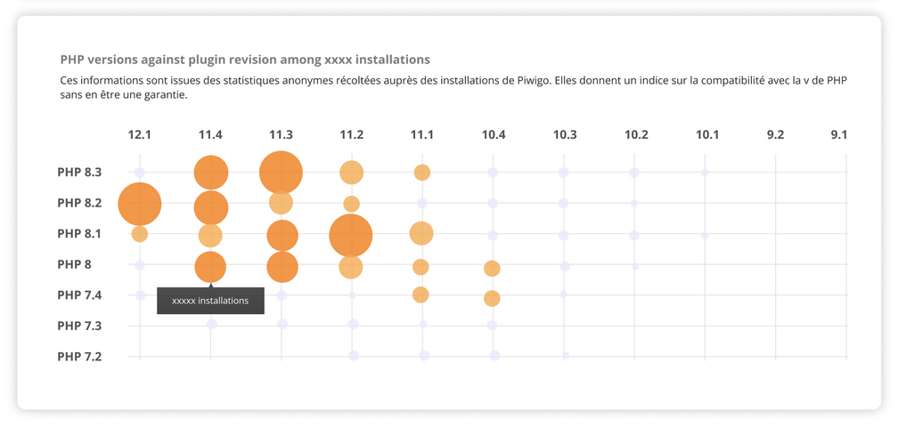

Implémenter en HTML/CSS/JS la maquette ci dessous :

 
 dans un premier temps, hardcoder des valeurs pour la taille des points orange. Dans un second temps, faire varier aléatoirement la valeur de chaque point au chargement de la page.

le résultat est disponible dans les pages github.